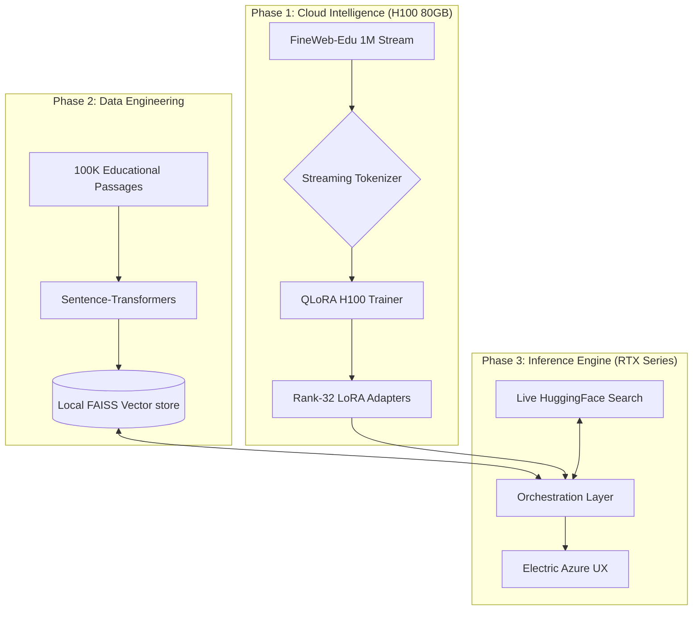

<div align="center">

# 🧠 InfoSage AI
### High-Performance Local Intelligence Engine for Educational Synthesis

**A flagship orchestration of Llama-2-13B, fine-tuned on the FineWeb-Edu corpus with integrated Hybrid RAG.**

[](https://huggingface.co/NousResearch/Llama-2-13b-hf)
[](https://huggingface.co/datasets/HuggingFaceFW/fineweb-edu)
[](https://www.nvidia.com/en-us/data-center/h100/)
[](https://www.nvidia.com/en-us/geforce/graphics-cards/40-series/rtx-4060-family/)
[](https://github.com/heyisula/infosage-13b)
[](LICENSE)

---

**InfoSage AI** is a professional grade AI ecosystem designed to bridge the gap between enterprise-scale LLM training and privacy conscious local inference. By leveraging Meta's **Llama-2-13B** architecture and a **1-million sample fine-tune** of the FineWeb-Edu dataset, InfoSage provides a high-fidelity educational assistant that runs entirely on your hardware.

⚠️ **Optimization Alert**: The training pipeline is exclusively optimized for **NVIDIA H100 80GB** hardware within the Google Colab Pro ecosystem.

[Training Guide](#-the-complete-cloud-training-pipeline) • [Asset Migration](#-the-great-migration-cloud-to-local) • [Local Setup](#-local-deployment--runtime) • [Technical Specs](#-technical-specifications)

</div>

---

## 📖 Project Overview

The current LLM landscape is bifurcated between high latency API models and underpowered local alternatives. **InfoSage AI** introduces a third path: **Cloud-to-Local Hybridization**. 

We utilize the raw power of **NVIDIA H100** clusters in the cloud to perform precision fine-tuning through **QLoRA**, then deploy the resulting intelligence to local **RTX** hardware using sophisticated 4-bit quantization. This allows a 13-billion parameter model to fit comfortably within an 8GB VRAM envelope while maintaining enterprise-grade reasoning.

---

## ✨ Key Features

| Feature | Technical Implementation | Impact |
| :--- | :--- | :--- |
| **Hybrid RAG** | Multi-layered FAISS + Live HF Streaming | Grounded answers with 0% "memory drift". |
| **QLoRA Mastery** | 4-bit NF4 + Double Quantization | 13B model runs comfortably on 8GB VRAM. |
| **Precision Post-Processing**| Automated Word Segmentation | Eliminates fine-tuning sub-word artifacts. |
| **Electric Azure UI** | Flask + Liquid Glass Design System | Premium, high-fidelity dashboard experience. |
| **Hardware Telemetry** | Real-time VRAM & Inference Monitoring | Full transparency into system resource usage. |
| **Cloud-to-Local Link**| Google Drive Automated Checkpointing | Seamless migration of multi-GB model weights. |

---

## 🏗️ Technical Architecture

InfoSage is orchestrated through a distributed pipeline that separates heavy-lifting compute from daily interactive inference.



---

## 🚀 The Complete Cloud Training Pipeline

To achieve the reasoning depth of a 13 billion parameter model, InfoSage leverages enterprise hardware. Follow these steps exactly to replicate the training results.

### 1. Environment Setup
1.  Open [Google Colab](https://colab.research.google.com).
2.  Upload the `train.ipynb` file from this repository.
3.  **Critical Hardware Selection**: Go to `Runtime` > `Change runtime type` and select **H100 GPU**. This model is specifically tuned for H100 VRAM and Tensor Core architectures.

### 2. Dataset Initialization (FineWeb-Edu)
The pipeline utilizes the **HuggingFaceFW/fineweb-edu** dataset.
*   **Streaming Mode**: The script is configured to stream 1,000,000 samples. This bypasses Colab's limited disk space by processing data directly from HuggingFace servers.
*   **Specialized Subset**: We focus on the high-quality educational score subset to ensure the model's "student-first" reasoning.

### 3. Executing the Training
1.  **Mount Google Drive**: The first cell will prompt for Drive access. This is essential for saving the model.
2.  **Hardware Diagnostics**: The internal `hw_diag` section will verify that thermal/memory limits are optimal for H100.
3.  **QLoRA Execution**: Run all cells. The training takes approximately **45-60 minutes** for 5,000 steps.
4.  **Automatic Persistence**: Upon completion, the script will create a directory in your Google Drive:  
    `My Drive/fineweb_edu_llama2_13b/`

---

## 📦 The Great Migration (Cloud to Local)

Once the training in Colab finishes, you must migrate the "brain" and "memory" of the system to your local machine.

### 1. Locate the Assets
Navigate to your Google Drive and find the following files in `/fineweb_edu_llama2_13b/`:

**From `final_model/`**:
- `adapter_model.safetensors` (The actual intelligence weights)
- `adapter_config.json` (The quantization mapping)
- `tokenizer.json` / `tokenizer_config.json` (Required for text processing)

**From `rag_index/`**:
- `faiss_index.bin` (The vector database)
- `passages.npy` (The raw text corpus for RAG)

### 2. Local Directory Mapping
You **must** create the following folder structure in the root of your cloned repository:

```text
fineweb-edu-llm-training/
├── out/
│   ├── final_model/            <-- Place safetensors & config here
│   └── rag_index/              <-- Place faiss_index.bin & passages.npy here
├── gui/                        <-- (Included in repo)
├── chat_llm.py                 <-- (Included in repo)
└── train.ipynb                 <-- (Used in Colab)
```

---

## 🖥️ Local Deployment & Runtime

### 1. Installation
The local runtime is optimized for **Windows/NVIDIA** environments.
```bash
# Install the high-performance local stack
pip install torch transformers datasets faiss-cpu sentence-transformers peft bitsandbytes accelerate wordsegment flask tqdm
```

### 2. Running InfoSage
InfoSage offers two modes of interaction:

**Option A: The Dashboard (Flagship Experience)**
Provides the full Azure glassmorphism experience with hardware telemetry.
```bash
python gui/app.py
# Open: http://localhost:5000 in your browser
```

**Option B: Terminal Mode**
Low-latency console interaction for developers and automated testing.
```bash
python chat_llm.py
```

---

## 🔍 Deep-Dive: Advanced Orchestration

### Hybrid Retrieval Mechanics
InfoSage doesn't just "remember"—it researches. The **Layered Retrieval** system operates as follows:
1.  **Tier 1 (Instant)**: Queries the local FAISS vector store. If a similar passage is found with >0.5 confidence, it is injected as context.
2.  **Tier 2 (Live Search)**: If local results are weak, the engine performs a live, keyword-filtered search across the full FineWeb-Edu dataset on HuggingFace.
3.  **Tier 3 (Synthesis)**: The Llama-2-13B model synthesizes a grounded answer using the retrieved "Educational Context" blocks.

### Precision Text Synthesis
Fine-tuned models often suffer from spacing artifacts (joinedwords). InfoSage integrates the `wordsegment` library into the post-generation pipeline. Every response is dynamically parsed and reconstructed to ensure human-grade readability at **15-20 tokens/sec**.

---

## 💻 Technical Specifications

| Parameter | Configuration Detail |
| :--- | :--- |
| **Foundation Model** | Llama-2-13B (NousResearch community mirror) |
| **Quantization** | 4-bit NormalFloat (NF4) with Double Quantization |
| **LoRA Config** | Rank 32 / Alpha 64 / Dropout 0.05 |
| **VRAM Buffer** | Specifically capped at 7,500 MiB for 8GB cards |
| **Attention Policy** | Flash Attention 2 (H100) / SDPA (Local Inference) |
| **Training Duration** | 5,000 steps / 1,000,000 samples subset |
| **Optimizer** | AdamW 8-bit (Paged) |

---

## 📂 Repository Governance

*   **[`gui/`](gui/)**: Full-stack dashboard assets (Flask backend, Azure frontend).
*   **[`chat_llm.py`](chat_llm.py)**: The orchestration kernel. Manages quantization, RAG routing, and post-processing.
*   **[`train.ipynb`](train.ipynb)**: **H100-Only** training pipeline for Google Colab.
*   **[`build_rag_index.py`](build_rag_index.py)**: Data engineering tool for FAISS index creation.

---

<div align="center">

**InfoSage AI is an open source research project licensed under the MIT framework.**  
*Developed with ❤️ for privacy-conscious intelligence using HuggingFace Transformers, PEFT, and a lot of GPU hours.*

</div>
