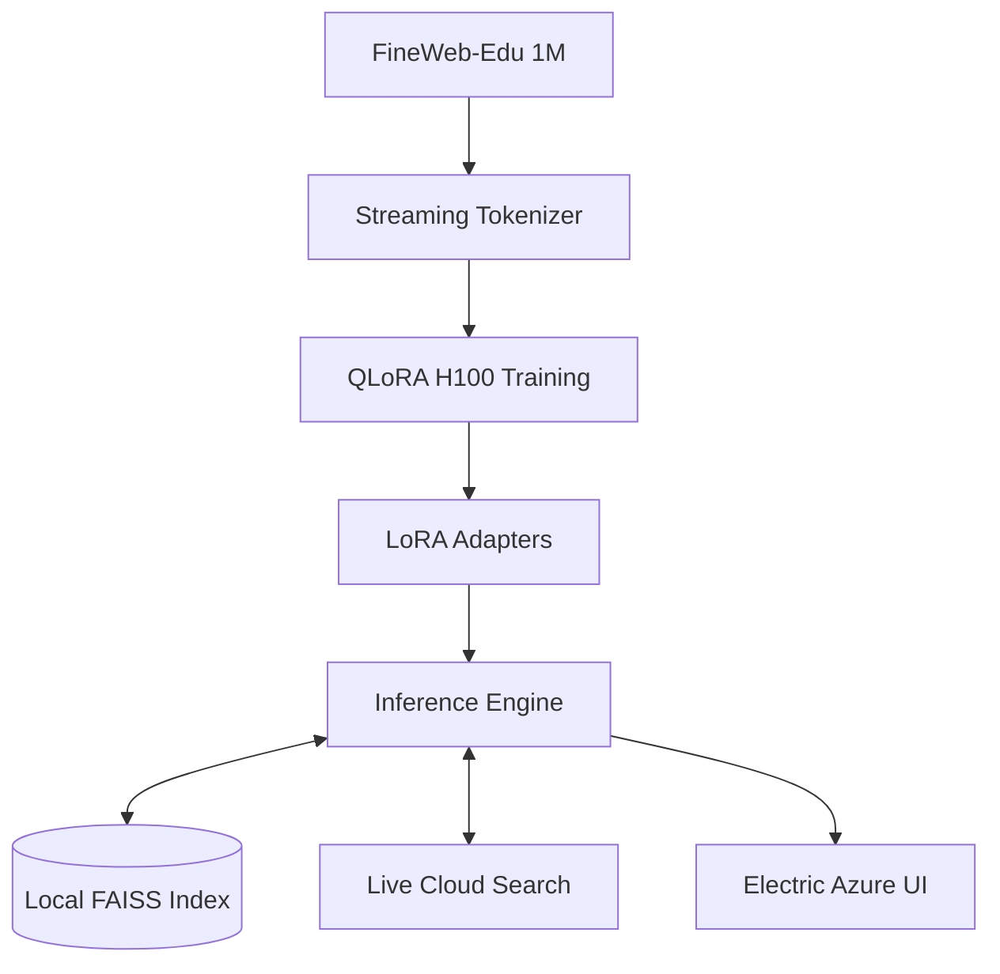

<div align="center">

# 🧠 InfoSage AI
### Advanced Local Intelligence Engine for Educational Synthesis

**An enterprise-grade interface for Llama-2-13B, fine-tuned on the FineWeb-Edu corpus.**

[](https://huggingface.co/NousResearch/Llama-2-13b-hf)
[](https://huggingface.co/datasets/HuggingFaceFW/fineweb-edu)
[](https://www.nvidia.com/en-us/data-center/h100/)
[](https://www.nvidia.com/en-us/geforce/graphics-cards/40-series/rtx-4060-family/)
[](https://github.com/heyisula/fineweb-edu-llm-training)
[](LICENSE)

---

**InfoSage** is a local-centric AI ecosystem designed for high-fidelity educational content retrieval and synthesis. By combining Meta's **Llama-2-13B** architecture with a massive **1M sample fine-tune** from the FineWeb-Edu dataset, the system provides superior clarity and reasoning while ensuring 100% data privacy on consumer hardware.

</div>

---

## 🏗️ End-to-End Workflow

### Phase 1: Machine Learning & Cloud Training
To achieve high-quality results with a 13-billion parameter model, we utilize **NVIDIA H100 80GB** acceleration in the cloud.

1.  **Preparation**: Upload `train.ipynb` to [Google Colab](https://colab.research.google.com).
2.  **Runtime**: Ensure the runtime type is set to **H100 GPU** (requires Colab Pro or equivalent).
3.  **Authentication**:
    *   The project uses the **NousResearch/Llama-2-13b-hf** mirror for ungated access.
    *   *Optional*: To use the official Meta model, update the `MODEL_NAME` and add your `HF_TOKEN` to Colab secrets.
4.  **Execution**: Mount Google Drive and run all cells. The script streams data directly from HuggingFace to avoid disk bottlenecks.
5.  **Outputs**: Training exports LoRA adapters, configuration files, and a standalone FAISS index directly to your `/content/drive/MyDrive/fineweb_edu_llama2_13b/` directory.

### Phase 2: Local Project Initialization
Once training is complete, move the assets to your local machine for inference:

1.  **Directory Mapping**: Create the following folders in the project root:
    *   `out/final_model/`: Copy `adapter_model.safetensors`, `adapter_config.json`, and all tokenizer files here.
    *   `out/rag_index/`: Copy `faiss_index.bin` and `passages.npy` here.
2.  **Environment Setup**:
    ```bash
    pip install torch transformers datasets faiss-cpu sentence-transformers peft bitsandbytes accelerate wordsegment tqdm flask
    ```

### Phase 3: GUI & Inference
Run the high-fidelity dashboard to interact with the model:
```bash
python gui/app.py
# Access via http://localhost:5000
```
*The GUI features real-time VRAM telemetry, automatic GPU detection, and a premium "Electric Azure" glassmorphism theme.*

---

## 🔍 Advanced Features

*   **Hybrid RAG Pipeline**: A dual-stage retrieval system. It first queries the local FAISS vector store. If confidence is low, it falls back to a live HuggingFace dataset search for real-time validation.
*   **QLoRA (4-bit NF4)**: Sophisticated quantization that maintains 13B model performance while fitting into an 8GB VRAM envelope.
*   **Precision Refinement**: Integrated `wordsegment` post-processing to eliminate spacing artifacts and ensure human-grade readability.
*   **Dynamic Diagnostics**: Real-time monitoring of it/s, tok/s, and hardware health (VRAM/GPU Model).

---

## 🏗️ Technical Architecture



---

## 📊 System Configuration

| Parameter | Specification |
| :--- | :--- |
| **Foundation Model** | Meta Llama-2-13B (NousResearch Mirror) |
| **Fine-Tuning Dataset** | FineWeb-Edu (1,000,000 samples) |
| **Compute Architecture** | NVIDIA H100 80GB HBM3 |
| **LoRA Config** | Rank 32 / Alpha 64 / Bio: None |
| **Quantization Type** | 4-Bit NF4 + Double Quantization |
| **Attention Mechanism** | Flash Attention 2 (Train) / SDPA (Local) |
| **Local GPU Limit** | 7500 MiB (Configured for 8GB cards) |
| **Performance** | ~1.2 it/s (H100 Training) / ~15-20 tok/s (Local Inference) |

---

## 📂 Repository Governance
*   **`gui/`**: Full-stack application assets (Flask, Outfit font, Azure theme).
*   **`chat_llm.py`**: Core orchestration for LLM loading, RAG routing, and post-processing.
*   **`build_rag_index.py`**: Standalone tool for rebuilding the FAISS knowledge base.
*   **`train.ipynb`**: High-performance cloud training pipeline.

---

<div align="center">
  <sub>InfoSage AI is an open-source project licensed under the MIT framework. Developed with ❤️ for privacy-conscious intelligence.</sub>
</div>
